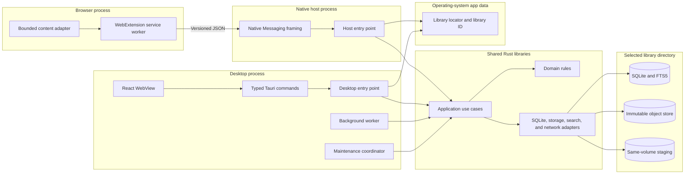
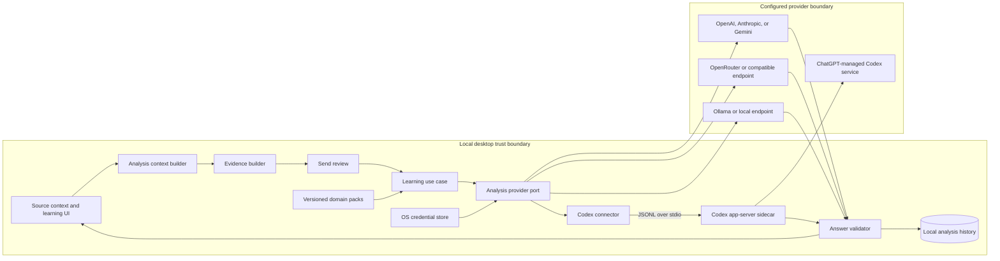
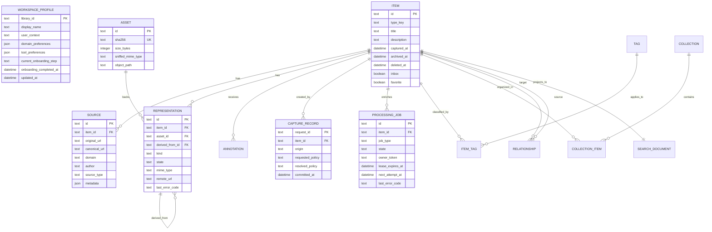
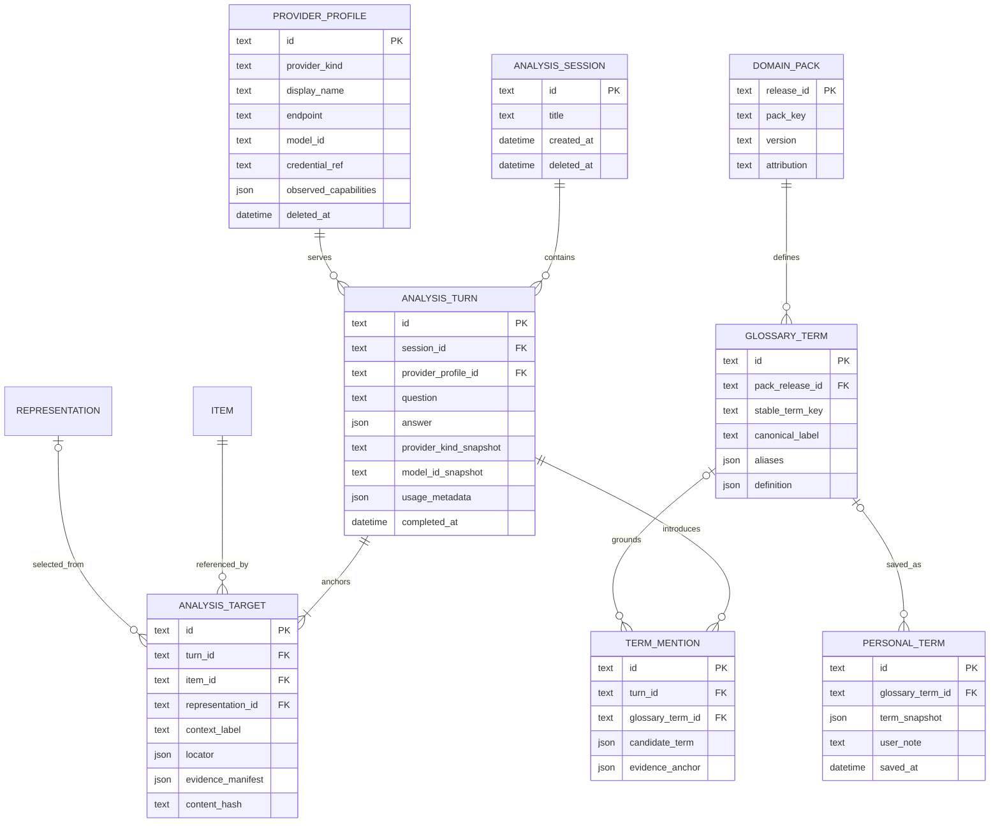
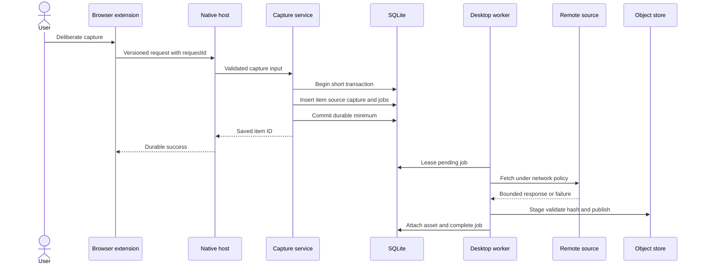

# Technical implementation blueprint v0.4

This revision keeps the strong center of v0.3: a local-first desktop library,
one capture model, SQLite as the source of truth, content-addressed assets, and
an explicit AI learning boundary. It adds authored onboarding and makes
multi-source questions a first-class learning interaction. The shipped MVP
includes AI learning, but the library remains usable without a configured model
or network. Use this document as the implementation plan; retain earlier
revisions as design history.

The [editable FigJam architecture board](https://www.figma.com/board/7Erp7hKIPw4WXOd4SaRbFk)
contains the process architecture, durable capture sequence, and core entity
model.

The companion [MVP screen and user-journey plan][journey-plan]
maps this architecture to the product's screen families, critical states, and
end-to-end interactions without fixing layouts.

## Review outcome

The proposed stack is sound. The original plan becomes implementation-ready
after the following corrections:

- Keep the local-first product boundary, Tauri/Rust/React stack, SQLite and
  FTS5, source/representation separation, content-addressed assets, unified
  capture, asynchronous enrichment, provenance, and optional-at-runtime AI
  learning.
- Add explicit ownership for migrations, background work, maintenance, backup,
  restore, library relocation, and reconciliation across the desktop and native
  host processes.
- Make transport replay, duplicate assets, and duplicate source URLs three
  separate deduplication concerns.
- Replace the ingestion claim of perfect database/filesystem atomicity with a
  provable invariant and a repair process.
- Define browser capture as a versioned, bounded, idempotent protocol rather
  than a mostly untyped object.
- Treat every remote fetch as a security and privacy boundary, including
  metadata downloads and previews, not only images rendered in the UI.
- Replace live database copying with SQLite's online backup mechanism and stage
  every restore or relocation before switching the active library.
- Reorder delivery into vertical slices. The native host, protocol, extension,
  and installer must be proven together rather than in isolated phases.
- Move unsupported future abstractions and unmeasured numeric targets out of
  the V1 architecture.
- Make AI analysis an explicit, user-initiated learning use case rather than an
  automatic enrichment or organization dependency.
- Ground domain language in versioned glossary packs and label model-proposed
  terminology that is not yet glossary-backed.
- Separate direct provider adapters, local model endpoints, and the Codex
  subscription connector behind one capability-aware application port.
- Use Codex app-server over local standard input and output for managed ChatGPT
  sign-in and subscription usage. Codex owns its session credentials; the
  application never receives or stores ChatGPT access tokens.
- Negotiate capabilities per configured model. Provider names alone do not
  prove support for images, documents, structured output, or streaming.
- Make onboarding write directly into the real local workspace so every choice
  is visible, resumable, and editable after completion.
- Model a learning turn as one or more anchored targets. A question about
  sources A, B, and C must preserve independent evidence and provenance for
  every source.

The architecture is a modular monolith with two executable entry points. It is
not a microservice system, and it does not need infrastructure that imitates
one.

## Product contract

The MVP release is complete only when the following behavior is proven on the
selected release platforms:

- First launch creates a local workspace without an account. Onboarding choices
  persist as they are made, visibly affect the real workspace preview, survive
  restart, and remain editable in settings.
- Onboarding can capture the user's first real source through the same durable
  capture use case as the rest of the app. It does not require AI setup.

- You can create, edit, organize, search, archive, trash, restore, import, and
  export items without an account, network connection, AI model, or external
  API.
- Images, GIFs, videos, PDFs, text, notes, URLs, articles, social references,
  and generic webpages can exist as items. Support means durable storage and a
  usable representation; it does not imply extraction for every format.
- Manual entry, clipboard, drag and drop, file import, URL capture, and browser
  capture enter the same application use case.
- A successful capture has committed its minimal item, source, capture record,
  and required enrichment jobs in one SQLite transaction.
- Enrichment or preservation failure never deletes the durable minimal capture.
- The database never exposes an `available` local representation whose object is
  absent. A crash may leave an unreferenced object, which maintenance can prove
  unused and remove.
- Soft-deleted items remain restorable with their assets until the user
  permanently empties trash.
- Backup, restore, and relocation verify all required data before replacing or
  switching the active library.
- React receives no arbitrary filesystem, SQL, process, or network capability.
  Every privileged operation passes through a typed, validated Rust boundary.

The required AI learning journey must also prove:

- The complete library remains usable when no AI provider is configured or an
  AI provider is unavailable.
- A user can target one or more saved sources, including an entire
  representation or a supported crop, page, text selection, frame, or time
  range, and ask a free-form learning question.
- A multi-source turn gives each target a stable context label and preserves an
  evidence anchor for every source-specific or comparative claim.
- Before a remote analysis request, the application identifies the provider,
  model, and prepared evidence that will leave the device and requires the
  user's deliberate send action.
- A learning answer separates visible evidence, domain terms, explanation,
  recreation guidance, and uncertainty. Each source-specific claim points back
  to an evidence anchor.
- Provider API keys never enter SQLite, logs, backups, exports, crash reports,
  frontend state persistence, or command arguments. Store them through the
  operating-system credential store and keep only an opaque reference locally.
- ChatGPT subscription authentication runs through Codex-managed browser or
  device-code login. The application does not use externally supplied ChatGPT
  tokens.
- Provider, model, authentication, rate-limit, cancellation, or malformed-output
  failures leave the source, local analysis history, and saved vocabulary
  intact.

## Scope and assumptions

The first implementation lane is provisionally Windows plus Chromium because
the current development environment is Windows and v0.1 places Chrome first.
This is a sequencing assumption, not a domain dependency. Confirm or replace it
before installer work begins.

V1 trusts the operating-system account and the security of the chosen storage
volume. Application-level encryption is not part of this revision. If the
library or backups must be encrypted independently of the operating system,
that decision changes storage, FTS, key management, recovery, and export and
must be made before schema implementation.

The AI learning surface is part of the MVP and is desktop-only. Model access is
optional at runtime: users can browse and organize without a provider, then
connect one when they first ask for model-assisted analysis. The layer supports
user-owned credentials, local model endpoints, and a Codex subscription
connector. It does not change the native host's short-lived capture
responsibility.

The following remain outside V1:

- Accounts, collaboration, cloud hosting, sync, public sharing, and mobile apps.
- Required OCR, embeddings, vector search, or AI-generated organization.
- Automatic background analysis, model-written tags or collections, provider
  web browsing, autonomous tools, and model-initiated file or process actions.
- Training or fine-tuning models on the library and uploading the library as a
  provider-side knowledge base.
- Large-scale scraping or authenticated browser-session asset transfer.
- Arbitrary embedded websites inside the desktop WebView.
- A guarantee that the current schema can later gain sync without conflict,
  change-tracking, and tombstone design work.

## Authored onboarding architecture

Onboarding is a resumable workspace-creation use case, not a temporary survey
or account funnel. On first launch, the application creates the local library
and its profile, then writes each accepted answer through the same application
boundary that settings uses after onboarding. The preview reads that persisted
state and real library data; it must not maintain a parallel onboarding-only
workspace model.

The profile stores local identity and context, domain interests, tool
preferences, and onboarding progress. Identity here personalizes the local
workspace and does not create a remote user account.

```text
WorkspaceProfile
├── library_id
├── display_name
├── user_context
├── domain_preferences[]
├── tool_preferences[]
├── current_onboarding_step
├── onboarding_completed_at
└── updated_at
```

Every onboarding response must produce a visible, durable consequence:

- Domain interests enable the corresponding local language packs and make
  relevant question starters discoverable.
- Tool preferences tailor recreation guidance while leaving the underlying
  learning-answer contract provider-neutral.
- Capture and privacy choices update the real storage and network policy shown
  by the workspace preview.
- The first source enters through the ordinary durable capture use case and is
  immediately available in the library.

The user can quit and resume from the last persisted step. Completion records
that the workspace is ready but does not freeze the profile; all choices remain
editable in settings. AI connection is offered when the user first invokes
**Ask**, not as a prerequisite for reaching the library. If application-level
encryption is later selected, onboarding requires a conditional key and recovery
branch because that decision changes initial library creation.

## System architecture

The desktop process and native host share application behavior, but each owns a
different lifecycle. SQLite and the object store are the local source of truth.



The dependency rule is `entry points -> application -> domain`. Infrastructure
implements ports required by the application layer. The domain layer never
imports Tauri, browser protocol, SQLite, filesystem, networking, or UI types.

### Process ownership

The desktop process owns long-lived and destructive coordination:

- Run schema migrations before accepting ordinary commands.
- Run background workers and reclaim interrupted jobs.
- Run object-store reconciliation, garbage collection, backup, restore, and
  relocation.
- Acquire an exclusive maintenance lock before migration, restore, relocation,
  or destructive reconciliation.
- Expose coarse, typed commands to the React WebView.

The native host owns one short transaction per browser request:

- Read and write length-prefixed Native Messaging JSON over standard input and
  output. Send diagnostics only to standard error.
- Validate the caller information supplied by the browser and rely on the
  installed host manifest's exact extension allowlist.
- Resolve the active library through the operating-system bootstrap locator.
- Reject incompatible schema, maintenance, unavailable-library, and invalid
  protocol states without attempting a migration.
- Invoke the same capture application service as the desktop, return one
  response, and exit when `sendNativeMessage` is used.
- Never fetch metadata, download assets, generate thumbnails, run migrations,
  or start a background worker.

The browser extension owns deliberate capture and bounded page extraction:

- Create capture UI only after a user action.
- Extract an allowlisted set of strings and URLs. Never send cookies, browser
  storage, full page HTML, or browsing history.
- Reuse the same request ID when retrying an uncertain delivery.
- Present durable-save success separately from later enrichment state.

When the desktop is closed, the native host can still commit the minimal capture
and jobs. Enrichment waits until the desktop next runs. If immediate enrichment
while the desktop is closed is a requirement, add a separately designed daemon;
do not silently turn the native host into one.

### Cross-process coordination

SQLite permits the desktop and native host to use separate connections. Keep
write transactions short, enable foreign keys on every connection, use WAL on
supported local filesystems, and handle `SQLITE_BUSY` as an explicit retryable
result. The selected busy policy must be derived from measured browser and UI
latency, not guessed.

WAL does not support network filesystems. V1 may support fixed and removable
local volumes, but it must reject or clearly mark network-backed library paths
as unsupported. An unavailable removable drive produces `library_unavailable`;
the host does not create a second hidden library.

Migration, restore, relocation, and permanent garbage collection acquire an
operating-system maintenance lock. While held, the native host returns a
retryable `library_maintenance` response and makes no change.

## AI analysis and learning architecture

The AI layer is a user-initiated desktop application use case. It analyzes one
or more user-selected targets, but it never becomes the source of truth for a
saved source, representation, or glossary. The application owns source
preparation, privacy review, answer validation, and learning state. A provider
owns only the model request it receives.



The dependency rule remains `entry point -> application -> domain`. The
application layer depends on an internal `AnalysisProvider` port and internal
request and answer types. Provider SDK types, HTTP payloads, Codex JSON-RPC,
credential-store APIs, and media decoders remain infrastructure details.

The native host never starts a model request. Browser capture can create the
source and representation that a later desktop analysis targets, but capture
success never waits for AI.

### Learning interaction contract

The primary interaction is source-first, not chat-first:

1. The user opens a saved source and selects the whole representation or a
   supported part of it. They can add more saved sources to the same question.
2. The UI offers free-form asking plus learning-oriented starters such as
   **Name this**, **Explain why it works**, **Describe it precisely**, and
   **How would I recreate it?** These are prompt affordances, not separate
   backend products.
3. The application assigns stable context labels such as A, B, and C, prepares
   the smallest evidence that preserves each selected context, and shows what
   will be sent, to which provider and model.
4. The model returns a structured learning answer. The UI makes the domain term
   prominent, then connects it to visible evidence, plain language, mechanics,
   and recreation guidance.
5. The user can save a glossary-backed term or a clearly labeled candidate term
   to personal vocabulary, add a note, and ask a follow-up against the same
   anchored context set.

`LearningAnswer` is the provider-neutral output contract:

```text
LearningAnswer
├── observations[]
│   ├── statement
│   ├── evidence_anchor: target_id + locator
│   └── basis: observed | inferred | uncertain
├── vocabulary[]
│   ├── canonical_term
│   ├── aliases[]
│   ├── definition
│   ├── why_it_applies
│   ├── distinguishing_signals[]
│   ├── contrasted_terms[]
│   └── glossary_reference | candidate
├── explanation
├── recreation
│   ├── transferable_principles[]
│   └── tool_specific_steps[]
├── uncertainties[]
└── useful_follow_ups[]
```

Do not request or store hidden chain of thought. The answer contract contains
concise conclusions, evidence anchors, and uncertainty that a user can inspect.
If a user asks for a term that the selected evidence cannot establish, the
answer must say what additional view, time range, or context would resolve it.

### Domain language packs

Domain language is product data, not prompt decoration. Ship versioned local
packs that grow independently of provider adapters. Begin with motion and
interaction design because the initial questions concern effects, movement,
description, and recreation. Each glossary entry contains:

- A stable term ID, canonical label, aliases, domain, and pack version.
- A plain-language definition and the signals that distinguish the term.
- Related and contrasted terms so the UI can teach boundaries, not only names.
- Curated examples or references when licensing permits them.
- Attribution and revision provenance for editorial review.

The prompt composer provides relevant glossary entries as candidate grounding,
but it does not force a match. The answer validator marks a term
`glossary-backed` only when its stable ID and pack version resolve locally.
Every other model-generated label remains a `candidate` until editorially
accepted into a pack. Updating a pack never rewrites the historical wording of
an answer; it updates the current term view and preserves the answer's recorded
pack version.

### Analysis targets and evidence preparation

Persist each target locator against immutable item, representation, or asset
identity, not against transient DOM nodes or screen pixels alone. Supported
locator forms are:

- Whole item or whole representation.
- Image crop in normalized representation coordinates.
- GIF or video time range plus the frames prepared for that request.
- PDF page with optional normalized region or extracted-text span.
- Text selection with stable offsets against a content hash.

The context builder produces an ordered `EvidenceBundle`. It contains one
`EvidenceManifest` per target with the target ID, stable context label, locator,
item and representation IDs, content hashes, prepared content kinds, and a local
preview. The label stays stable for the sent turn even if the user reorders the
working context later. Preparation follows these rules:

- Send a selected subset instead of the full source when the subset is enough.
- Render PDF pages and sample selected animation or video ranges locally when a
  provider does not accept the original format.
- Include adjacent context only when it is necessary to interpret the target,
  and show that context in the send review.
- Never give a provider an authenticated source URL or ask it to fetch the
  source. Send prepared text or bytes from an allowed local representation.
- Treat text inside a source as untrusted data, not as model instructions.
- Remove prepared temporary evidence after completion or cancellation. Startup
  reconciliation removes abandoned analysis staging after proving it is not
  referenced by an active request.

Reference-only sources may not have enough local evidence to analyze. In that
case, the UI offers an explicit preservation or bounded-fetch action under the
existing network policy. It does not silently send the source URL to a model.

A sent turn owns an immutable snapshot of its ordered target set. Editing the
working context after send creates targets for a later turn; it never changes
the provenance of an existing answer. A source-specific or comparative answer
claim is valid only when its evidence anchor resolves to one of that turn's
target IDs.

### Provider gateway and capability negotiation

Support popular providers through a small set of behaviorally distinct
adapters. Do not claim that one compatible HTTP shape makes providers
semantically interchangeable.

- **Direct cloud:** OpenAI, Anthropic, and Google Gemini use the OS credential
  store. Capabilities come from provider model metadata plus adapter checks.
- **Model router:** OpenRouter uses the OS credential store and its model and
  endpoint catalogs.
- **Local runtime:** Ollama has no credential by default and exposes a local
  model catalog plus a capability probe.
- **Compatible endpoint:** An advanced user can configure an
  OpenAI-compatible service and an optional key. Use discovery when available;
  otherwise require explicit profile capabilities.
- **Codex subscription:** Codex app-server owns ChatGPT login. Use `model/list`
  and account methods for current model, modality, plan, and rate-limit state.

A provider profile stores only nonsecret configuration: provider kind, display
name, normalized endpoint, selected model ID, opaque credential reference,
declared local-network trust, and last observed capabilities. Capabilities are
per profile and model, and include accepted input kinds, structured output,
streaming, and cancellation behavior.

Configuration checks authentication separately from model capability and
structured-output compatibility. A valid key does not prove that the selected
model accepts an image or the answer schema. This separation prevents the UI
from treating every provider-side schema error as a credential failure.

Before every request, the gateway compares every manifest in the
`EvidenceBundle` and the answer contract with current model capabilities. It
either prepares an allowed conversion for each target, asks the user to choose
another configured model, or returns a stable unsupported-capability error that
identifies the affected context label. It never silently drops a target or
changes provider or model because that would change the question, privacy,
cost, behavior, and account usage.

Normalize provider streams into application events for started, text delta,
completed, cancelled, usage metadata, and failure. Preserve provider request
IDs for diagnostics, but redact keys and source content. Retry behavior follows
the provider's documented error semantics and never repeats a billable request
after an ambiguous completion without user confirmation.

### Codex subscription connector

Use Codex app-server for the requested subscription path. This is a distinct
connector, not an OpenAI API adapter and not a way to convert a ChatGPT session
token into an API key.

Release builds should bundle a pinned, notice-compliant Codex runtime as a
Tauri sidecar. App-server schemas are generated for a specific Codex version,
so pinning the runtime and committed schema is required to make the integration
testable. A developer override may select an installed compatible runtime, but
release behavior must not depend on whichever Codex version happens to be on
the machine.

Start `codex app-server` with its default local `stdio` transport and a
dedicated application `CODEX_HOME`. Do not use the experimental WebSocket
transport. The
dedicated home prevents inheritance of the user's coding projects, MCP servers,
plugins, skills, and global instructions. Configure Codex to keep credentials in
the operating-system keyring when the platform supports it.

The connector performs this lifecycle:

1. Spawn the sidecar without a shell, initialize JSON-RPC with a stable client
   name, and verify the pinned protocol contract.
2. Call `account/read`. If no ChatGPT account is active, call
   `account/login/start` with the managed browser flow or device-code flow.
3. Open the returned authorization URL in the system browser and wait for
   `account/login/completed` and `account/updated`. Codex stores and refreshes
   the credentials. Do not implement experimental externally managed ChatGPT
   tokens.
4. Use `model/list` to show only current models and input modalities. Surface
   `account/rateLimits/read` as account status without inventing a per-request
   cost estimate.
5. For an analysis turn, create an isolated staging directory containing only
   the prepared evidence, start a read-only thread with approvals denied and
   tool-accessible network, MCP, plugin, skill, and command capabilities
   unavailable, and send the learning request.
6. Validate and persist only the normalized `LearningAnswer`, usage metadata,
   provider and model snapshot, and evidence manifest. Delete the temporary
   Codex thread and staged evidence. Startup reconciliation removes connector
   threads left by a crash inside the dedicated app home.

Register the integration's client identity with OpenAI before an enterprise
release that depends on compliance-log identification. Include the Codex
license and notices in distributed third-party notices, and use the Codex name
only for accurate source attribution and account connection copy.

### Secrets and provider network policy

The React layer sends a secret to Rust only during the explicit add or replace
credential action. Rust writes it directly to the operating-system credential
store, clears transient buffers as practical, and returns only profile status.
Provider keys never round-trip back to React.

Provider traffic uses a policy separate from untrusted source fetching:

- Direct providers use their fixed HTTPS origins.
- A compatible endpoint sends credentials only to its normalized configured
  origin and never forwards authorization across a redirect.
- Ollama and other explicit local runtimes may use loopback HTTP. A private LAN
  endpoint requires a separate profile-level trust decision.
- Source URLs still follow the stricter source-fetch policy and cannot inherit
  a provider endpoint exception.
- Logs retain stable error codes and provider request IDs, not authorization
  values, prompt bodies, prepared media, or model output.

Analysis is never a background enrichment job. Every remote request follows a
visible user action, and cancellation propagates to the adapter when the
provider protocol supports it. Closing the answer UI does not delete a saved
source or vocabulary state.

## Repository structure

Start with boundaries that are required by the two binaries. Do not create one
crate per noun before independent compilation or dependency direction requires
it.

```text
inspiration-library/
├── apps/
│   ├── desktop/
│   │   ├── src/
│   │   └── src-tauri/         # Tauri entry point and sidecar packaging
│   └── browser-extension/
│       ├── src/
│       └── manifests/
├── crates/
│   ├── library-core/          # Domain and application use cases
│   ├── library-infrastructure/# SQLite, files, search, providers, processors
│   ├── capture-protocol/      # Versioned transport DTOs and schema export
│   └── native-host/           # Stdio entry point only
├── packages/
│   └── generated-contracts/   # Generated TypeScript protocol and IPC DTOs
├── domain-packs/               # Versioned glossary data and attribution
├── schemas/
│   └── codex-app-server/       # Schema generated from the pinned runtime
├── migrations/
├── tests/
│   ├── fixtures/
│   ├── fault-injection/
│   ├── provider-contracts/
│   └── e2e/
└── docs/
    ├── architecture/
    ├── data-model/
    └── protocols/
```

`library-core` can use internal Rust modules for capture, items, organization,
jobs, and policies. Split a module into another crate only when the split proves
a dependency, build, reuse, or isolation requirement.

The Rust transport structs are the protocol authority. Build tooling exports a
machine-readable schema and generated TypeScript types. Runtime validation runs
on both sides, and CI fails when committed generated contracts drift from Rust.
Domain entities and transport DTOs remain different types.

## Domain and persistence model

Use one globally unique opaque ID for each entity. Do not keep both `id` and
`uid` without distinct semantics. Store timestamps in UTC and define when each
timestamp changes.



### AI learning persistence

Keep AI history local and store the normalized learning contract, not the raw
provider response or hidden reasoning. The core item model remains valid when
these tables are empty.



`ANALYSIS_TARGET` records exactly what the answer was about. A turn has one or
more targets, and each target owns a context label that is unique within that
turn. The evidence manifest records prepared parts and hashes, not duplicate
media bytes. Query source history by joining items through targets rather than
binding an entire session to one item. `ANALYSIS_TURN` stores the provider and
model snapshot because a profile may later change. `TERM_MENTION` contains
either a glossary term reference or a candidate-term snapshot. Enforce that
invariant with a database check.

Deleting a source permanently does not rewrite a completed lesson. Preserve the
normalized answer and target snapshot, mark its local anchor unavailable, and
remove media bytes only when the ordinary object-ownership rules prove them
unreferenced.

`DOMAIN_PACK` is unique across `pack_key` and `version`. `GLOSSARY_TERM` is
unique across `pack_release_id` and `stable_term_key`, which lets later pack
versions preserve term identity without overwriting history.

`PROVIDER_PROFILE.credential_ref` is an opaque keyring handle. It is null for a
Codex-managed account and for a local endpoint that has no credential. Removing
a profile deletes its keyring secret, clears the credential reference, and
soft-deletes the connection record. Completed lessons retain their historical
provider snapshots.

Personal vocabulary survives removal of an analysis session because it is a
learning artifact in its own right. If its source evidence is later permanently
purged, keep the term snapshot and mark the evidence link unavailable rather
than deleting the saved term.

### Entity semantics

Use these meanings consistently:

- `WorkspaceProfile` stores the local library's authored identity, preferences,
  and resumable onboarding state. It is not a remote account or user record.
- `Item` is the conceptual object the user saved.
- `Source` records where the item was found. A canonical URL is a deduplication
  signal, not a unique key and not permission to merge items silently.
- `Representation` records a remote, local, snapshot, thumbnail, or extracted
  view of an item. A local representation becomes `available` only after its
  asset exists.
- `Asset` records an immutable content-addressed blob. The hash is unique in the
  library. The object path is relative to the library root.
- `Annotation` stores item notes and optional representation anchors. An
  annotation without a representation is an item-level note. Do not duplicate
  the same concept in `items.user_notes`.
- `CaptureRecord` provides transport idempotency and a durable audit trail.
- `ProcessingJob` represents asynchronous enrichment, not message-broker
  infrastructure.
- `SearchDocument` is the normalized text projection for one item.

Keep tags flat. Keep collections flat in V1. Add collection nesting only after
the product requires a hierarchical collection interaction; adding a nullable
parent later is a routine migration and does not justify unused behavior now.

Relationships are directed and use an extensible text `relation_type`. Give
each row its own ID, foreign keys, and uniqueness across source, target, and
type. The application layer defines whether a relation type is symmetric and
creates or queries its inverse accordingly.

### Three different deduplication problems

Do not collapse these behaviors into one generic `dedupe` feature:

- **Transport replay:** A repeated `request_id` returns the previously committed
  result and never creates a second item.
- **Binary identity:** Equal SHA-256 content reuses one immutable asset row and
  object.
- **Semantic/source similarity:** A matching canonical URL or metadata creates
  a merge candidate. It never silently merges deliberate captures.

## Capture protocol

All entry points map into the same application `CaptureInput`, but browser
transport has its own versioned envelope.

```json
{
  "protocolVersion": 1,
  "messageType": "capture",
  "requestId": "globally-unique-id",
  "payload": {
    "origin": "browser_context_menu",
    "storageIntent": "smart",
    "content": {
      "kind": "image_reference",
      "sourceUrl": "https://example.test/image.png",
      "pageUrl": "https://example.test/article"
    },
    "title": "Optional bounded title",
    "selectedText": "Optional bounded selection",
    "capturedAt": "UTC timestamp"
  }
}
```

Model `content` as an explicit tagged union for URL, page, image reference,
selection, and text capture. Use typed optional fields instead of unrestricted
`media`, `metadata`, and `page_context` bags. Define schema-derived size and
count constraints after measuring legitimate fixtures and browser limits.

Return structured error codes such as `invalid_request`,
`unsupported_protocol`, `upgrade_required`, `library_unavailable`,
`library_maintenance`, and `capture_failed`. Human wording belongs in the
extension and can change without changing the protocol.

Support a protocol compatibility window only when a release transition requires
it. Do not promise simultaneous support for every adjacent version by default.

Native Messaging transports metadata and instructions, not general binary
files. For content that Rust cannot fetch without a browser session, V1 stores
the reference and bounded extracted metadata. Authenticated binary transfer is
deferred until it has a separate, size-bounded, permission-aware protocol.

## Durable capture and background work

The minimal capture transaction inserts or reuses the transport record, creates
the item and source, records the resolved policy, creates pending
representations, and enqueues required jobs. It commits before the browser or UI
receives success.



Jobs use an atomic lease claim with an owner token and expiry. Handlers are
idempotent. On startup, the desktop reclaims expired leases and resumes work.
Classify errors as permanent, retryable, or user-action-required. Derive retry
timing and resource ceilings from measured behavior and product policy rather
than embedding arbitrary counts.

## Crash-safe object storage

Put ingestion staging under the selected library so publication stays on the
same filesystem as the object store.

```text
Library/
├── library.sqlite
├── library-id.json
├── objects/
├── temp/ingest/
├── cache/
└── backups/
```

Use this publication order:

1. Stream bytes to a uniquely named staging file while enforcing the selected
   resource policy.
2. Flush the staging file, sniff content type, validate the supported format,
   inspect safe metadata, and calculate SHA-256.
3. Publish the immutable object with a same-volume create-if-absent atomic
   rename. If the object already exists, verify and reuse it.
4. In one SQLite transaction, insert or reuse the asset row, attach the
   representation, mark it `available`, and update related storage accounting.
5. Remove the staging file. If the process crashes after object publication but
   before database commit, leave the unreferenced object for reconciliation.

This order proves the important invariant: committed `available` local
representations point to existing objects. It deliberately permits harmless
orphan objects after a crash because a database transaction cannot be atomic
with a filesystem rename.

Run reconciliation under the maintenance lock. Compare immutable objects with
committed asset references, repair safe missing metadata, and remove only
objects proven unreferenced after active ingestion is excluded.

### Trash and garbage collection

Soft deletion sets `items.deleted_at` and removes the item from ordinary search
and library views. It does not remove representations or assets.

Only **Empty Trash** permanently removes item-owned rows. After that
transaction, garbage collection can delete an object whose asset has no
remaining representation references. A zero count among active items is
insufficient;
trash items still own their assets until permanent deletion.

## Search architecture

Use one `search_documents` projection row per item and an FTS5 index keyed to
its integer row ID. The projection contains normalized title, description,
annotation text, extracted text, author, source domains, tags, and collection
names.

Recompute the affected projection in the same transaction as an item, source,
annotation, tag, or collection mutation. Use FTS triggers or explicit
transactional writes, and add integrity and rebuild commands. External-content
FTS5 tables require the application to keep the index and content table in sync.

Return:

- Item ID and stable item summary.
- Rank and matched field identifiers.
- Sanitized highlighted fragments produced from FTS5 `snippet` or `highlight`
  output and converted into typed text segments in Rust.
- A stable cursor based on the ordered query result, not an offset over the
  entire library.

Do not promise raw character ranges from FTS5 unless a tokenizer-aware mapping
is implemented and tested. Keep ranking inside Rust so a later additional search
strategy can be composed without changing UI routes. Do not create a no-op
semantic index in V1.

Keep lessons and personal vocabulary in a separate FTS5 projection. Users can
search past questions, normalized answers, canonical terms, aliases, and notes
without letting model-generated prose change ordinary library-item ranking.
The item detail view may expose related lessons by item ID; global search must
make the library and learning scopes visible rather than blending their ranks.

The gallery uses keyset pagination, lazy local thumbnails, and virtualization.
Set performance budgets only after the owner supplies an expected workload and
the benchmark corpus measures latency and memory on target hardware.

## Storage and network policy

Separate the user's storage intent from network behavior:

```text
Storage intent
├── Reference
├── Preserve
└── Smart

Network policy
├── Fetch metadata on capture
├── Fetch assets for preservation
├── Allow remote preview
└── Refresh remote sources
```

Record both the requested storage intent and resolved policy on the capture.
Changing defaults does not retroactively download or delete existing content;
that requires an explicit reprocess action.

Do not render arbitrary remote URLs directly in the WebView. Route permitted
previews through the Rust fetch policy and a bounded cache, then expose local
content by opaque asset or cache ID. Keep **Open Source** as an external-browser
action.

Every Rust fetch must:

- Accept only supported HTTP and HTTPS URLs.
- Reject loopback, link-local, private, multicast, unspecified, and local
  machine destinations unless a future explicit local-network feature defines
  a narrower policy.
- Resolve and validate every destination and revalidate every redirect.
- Send no browser cookies, authorization headers, or ambient credentials.
- Stream under configured byte, time, redirect, and decoder-resource ceilings.
- Treat declared MIME types as hints and validate the received content.
- Sanitize or reduce HTML to inert extracted text and safe metadata.
- Redact sensitive URL components and private content from logs.

These controls address the fact that a deliberately captured page can still
provide attacker-controlled media URLs targeting services on the local machine.

## Tauri and frontend boundary

Expose coarse application use cases through Tauri commands, not table-shaped
CRUD or raw paths. Command DTOs are generated and validated, and each command
maps errors to stable codes.

Command groups include workspace profile and onboarding, items, organization,
search, capture, settings, storage, relationships, jobs, analysis, provider
profiles, vocabulary, backup, and maintenance. React refers to assets by ID and
cannot supply arbitrary write destinations, SQL, executable paths, or provider
request payloads.

Credential commands accept a secret only for add or replace and return a
redacted connection status. Analysis commands accept an ordered set of target
locators, a question, and a configured profile ID. Rust resolves every source,
builds the evidence bundle, applies network and credential policy, and emits
normalized progress events.
React never receives a provider key, Codex token, arbitrary endpoint client, or
raw provider stream.

Use Tauri capabilities and scopes per WebView. Keep the Content Security Policy
narrow, disallow remote application origins, and expose only the commands the
main local WebView needs. Captured HTML never executes in the WebView.

Keep the React application feature-oriented. TanStack Query owns Rust-backed
server state; local component state owns transient UI behavior. Add Zustand
only after shared UI state proves it is necessary. Use semantic design tokens,
but keep navigation, component libraries, layout, animation, and visual density
outside the technical architecture.

## Backup, restore, export, and relocation

A valid backup is a consistent snapshot, not a live copy of
`library.sqlite`.

Create a backup as follows:

1. Use SQLite's online backup API to create a database snapshot while ordinary
   reads and writes continue.
2. Read the snapshot to enumerate exactly the immutable objects it references.
3. Copy those objects, settings required to interpret the library, and a
   versioned manifest with checksums.
4. Verify the completed archive before reporting success. Exclude cache and
   temporary files.

Restore and relocation use a staging location on the destination volume:

1. Validate archive structure and prevent path traversal.
2. Validate manifest, schema compatibility, database integrity, object presence,
   and checksums.
3. Acquire the maintenance lock and close ordinary database handles.
4. Atomically switch the library directory or locator only after every check
   passes.
5. Retain the previous library until the new one opens successfully.

JSON is the canonical portable metadata export. CSV is a flattened convenience
export and cannot round-trip nested sources, representations, annotations, or
relationships. Neither format is a backup.

Backups include the workspace profile and onboarding state, local analysis
sessions, normalized answers, target manifests, personal vocabulary, and
nonsecret provider-profile metadata. They exclude API keys, Codex credentials,
raw provider requests and responses, temporary evidence, and provider caches.
After restore on another machine, every external profile is disconnected until
its credential or Codex login is re-established.

The portable JSON export can include normalized lessons and vocabulary with
their evidence anchors. It never includes credential references because those
handles are machine-specific and not useful outside the credential store.

The operating-system bootstrap locator stores the active library path and
library ID. The selected library stores only relative object paths. Moving a
library changes the locator after verification; it does not rewrite every asset
row.

## Security and privacy acceptance

Treat the React WebView, browser-extracted metadata, captured HTML, URLs, remote
bytes, imported files, and restore archives as untrusted inputs.

The release evidence must include:

- Tauri command validation and least-privilege capability tests.
- Browser protocol schema, request-id replay, wrong-extension, malformed
  framing, oversized-field, and incompatible-version tests.
- URL tests for alternate IP encodings, DNS changes, redirects to blocked
  destinations, unsupported schemes, and local metadata endpoints.
- HTML and search-highlight injection tests.
- Archive path traversal, checksum, incompatible schema, and interrupted restore
  tests.
- Asset parser and thumbnail resource-exhaustion fixtures.
- Log redaction tests covering URLs, selected text, filenames, tokens, and page
  content.
- Provider-profile tests proving secrets never reach SQLite, frontend state,
  logs, backup, export, diagnostics, or child-process arguments.
- Evidence-bundle tests for single- and multi-source image crops, text ranges,
  PDF regions, and media time ranges, including mixed supported and unsupported
  inputs, stale content hashes, missing targets, and unavailable
  representations.
- Prompt-injection fixtures proving captured source text remains inert and no
  provider adapter exposes tools, ambient files, or source-fetch credentials.
- Provider contract fixtures separating authentication, model capability,
  malformed structured output, rate limiting, cancellation, and ambiguous
  completion.
- Codex sidecar tests for managed login, version mismatch, unavailable model,
  read-only isolation, denied tools and network, thread cleanup, and crash
  reconciliation without exposing cached credentials.
- Learning-answer validation tests proving every source-specific and comparative
  evidence anchor resolves to the correct stable context label and candidate
  terms are never presented as glossary-backed.

If application-level encryption is not selected, product copy must state that
library and backup confidentiality depends on the operating system and storage
volume.

## Delivery plan

Deliver vertical slices that close a user-visible and architectural loop. A
phase exits only when its evidence passes; component completion alone is not an
exit condition.

### Foundation and owner decisions

Build the Cargo and frontend workspaces, migrations, error codes, structured
logging, generated protocol contracts, library locator, and typed
React-to-Tauri ping.

Exit evidence: a clean checkout builds, the UI invokes Rust through a scoped
command, Rust opens a migrated temporary library, and contract generation has no
drift.

### Durable local library slice

Implement items, sources, representations, annotations, tags, flat collections,
relationships, inbox, archive, trash, restore, and manual text and URL capture.

Exit evidence: the complete local workflow survives restart, failed
transactions leave no partial capture, and request replay returns the original
item.

### Crash-safe asset slice

Implement drag and drop, file import, staging, hashing, MIME inspection,
content-addressed publication, thumbnail generation, storage accounting,
permanent trash purge, and reconciliation.

Exit evidence: fault injection at every publication boundary never produces an
available missing object or deletes an asset still owned by another or trashed
item.

### Search and organization slice

Implement the search projection, FTS5 indexing, filters, highlighted fragments,
keyset pagination, gallery virtualization, index integrity, and rebuild.

Exit evidence: every indexed mutation stays consistent, malicious text renders
inertly, and the owner-approved benchmark corpus meets recorded target-hardware
budgets.

### Asynchronous enrichment and policy slice

Implement the leased SQLite job worker, metadata fetch, public asset download,
thumbnail and safe text processors, storage-policy resolution, network policy,
privacy settings, and independent representation failures.

Exit evidence: capture success precedes slow enrichment, worker termination is
recoverable, private-network fetch attempts are blocked, and failures retain a
usable minimal item.

### Authored onboarding and first-source slice

Implement the workspace profile, resumable onboarding progress, live preview
against real persisted state, domain and tool preference effects, and first
source capture through the ordinary capture use case. Keep provider connection
out of the required onboarding path.

Exit evidence: every accepted response visibly changes the real workspace,
restart resumes from persisted progress, completion retains the first source in
the library, and a user who skips AI connection can enter and use the library.
Editing the same choices later in settings produces the same workspace behavior.

### Grounded AI learning vertical slice

Implement provider profiles, credential-store references, the first native
provider adapter, the motion and interaction design pack, image-crop and
text-selection targets, ordered multi-source context, evidence review, the
normalized learning-answer contract, anchored follow-ups, local lesson history,
and personal vocabulary.

Exit evidence: a user can select visible evidence from one or more sources,
approve every prepared target, receive an answer that distinguishes observation
from inference and glossary-backed terms from candidates, trace comparative
claims to the correct context labels, save a term, restart, and continue from
the same immutable context snapshot. No provider credential or prepared
evidence appears in SQLite, logs, backup, export, frontend persistence, or
diagnostics. The library remains fully usable when the provider is removed or
offline.

### Provider and Codex expansion slice

Add the native OpenAI, Anthropic, and Google Gemini adapters; OpenRouter;
Ollama; the advanced OpenAI-compatible adapter; capability discovery and
contract fixtures; PDF, GIF, and video locators; and the pinned Codex app-server
sidecar with managed ChatGPT login.

Exit evidence: each configured provider passes the same provider-neutral
learning contract for the modalities it advertises, and unsupported combinations
fail before content is sent. Authentication failure is distinguishable from
model or schema incompatibility. A signed-in Codex user can complete an analysis
through included subscription usage, inspect current rate-limit state, sign out,
and leave no application-readable ChatGPT token. Cancellation, sidecar crash,
and app restart leave no active request, writable analysis workspace, or
unreconciled connector thread.

### Browser capture vertical slice

Implement one selected Chromium manifest, context menus, bounded generic page
and image adapters, the versioned protocol, native host, bootstrap locator,
installer registration, and extension feedback together.

Exit evidence: local fixtures for page, selection, image, redirect, duplicate,
missing media, malformed metadata, and inaccessible media pass through browser,
host, core, database, and desktop. Capture works while the desktop is closed;
enrichment resumes when it opens.

Add site-specific adapters only after fixture-backed generic capture is stable.
A social post remains saveable as a reference when its specialized adapter
fails.

### Portability slice

Implement online backup, verified staged restore, JSON and CSV exports,
relocation, unavailable-volume handling, and database/object integrity tools.

Exit evidence: backup during concurrent capture restores to the same logical
library, corrupted archives never replace user data, and a failed relocation
leaves the original locator and library usable.

### Release hardening

Complete the selected platform and browser matrix, installer and uninstaller,
migration compatibility, recovery UX, accessibility behavior, provider and
Codex compatibility, third-party notices, dependency audit, diagnostic export,
and full acceptance suite.

Exit evidence: a clean machine installs the app and native host, a deliberate
capture reaches the library, uninstall removes integration without deleting the
library, and every product-contract criterion is proven.

## Claims removed from V1

The following earlier-plan claims do not pass the necessity test for the stated
V1:

- A `NoopSemanticIndex` adds an unused abstraction; introduce a second search
  implementation when one exists.
- Nested collections add behavior with no V1 interaction requirement; migrate
  when hierarchy becomes a product decision.
- One Rust crate per subsystem adds boundaries before dependency pressure proves
  them; begin with required entry-point, core, infrastructure, and protocol
  boundaries.
- Exact automatic-download sizes, thumbnail dimensions, item-count targets, and
  retry counts lack owner or measured authority; keep policy fields and set
  values from product decisions and benchmarks.
- Authenticated browser-session binary preservation has no safe transport in
  the proposed V1; degrade to reference and bounded metadata.
- Supporting two protocol versions at all times is unnecessary; define a
  compatibility window per release transition.
- Future sync is not guaranteed by local IDs and content-addressed assets;
  change tracking, tombstones, conflicts, and identity require a separate plan.
- Full multi-platform distribution is not an early foundation gate; prove one
  release lane, then add owner-selected platforms without moving domain logic.
- A universal provider abstraction does not prove equal capability or output;
  keep native adapters and negotiate per model.
- Automatic AI tags, collections, descriptions, or batch analysis would change
  the explicit-consent and local-first contract; keep them out of V1.
- Passing source URLs to providers for convenience violates the evidence review
  and source-fetch boundary; prepare local evidence instead.
- Importing or managing raw ChatGPT access tokens is unnecessary. Codex
  app-server already owns managed browser and device-code login.
- Agent tools, MCP servers, plugins, inherited skills, and writable workspaces
  add capability that the learning turn does not need; disable them in the
  dedicated Codex connector.
- Model-generated vocabulary is not authoritative domain language. Preserve it
  as a candidate until a versioned local glossary pack backs it.

## Owner questions

These choices materially change implementation and cannot be invented by the
technical plan:

1. Must the library and backups have application-level encryption, or may V1
   rely on operating-system account and disk security?
2. Is Windows plus Chromium the correct first distributable lane?
3. What are the default network and storage choices: reference, preserve, or
   smart; metadata fetch on or off; remote previews on or off?
4. Does browser capture while the desktop is closed require only durable
   queueing or immediate background enrichment?
5. What expected library workload and target hardware authorize performance,
   download, thumbnail, and parser-resource budgets?
6. Should release builds bundle the pinned Codex sidecar as recommended, or
   require users to install a compatible Codex runtime separately?
7. Must every remote analysis show the evidence review, or may a user remember
   consent for a specific provider profile and source privacy class?

## Source notes

The revision uses primary platform documentation for unstable technical claims:

- [Tauri security and trust boundaries](https://v2.tauri.app/security/)
- [Tauri commands and events](https://v2.tauri.app/concept/inter-process-communication/)
- [Chrome Native Messaging lifecycle and framing](https://developer.chrome.com/docs/extensions/develop/concepts/native-messaging)
- [Mozilla Native Messaging differences](https://developer.mozilla.org/en-US/docs/Mozilla/Add-ons/WebExtensions/Native_messaging)
- [SQLite write-ahead logging](https://sqlite.org/wal.html)
- [SQLite online backup API](https://sqlite.org/backup.html)
- [SQLite FTS5](https://sqlite.org/fts5.html)
- [OWASP SSRF prevention guidance](https://cheatsheetseries.owasp.org/cheatsheets/Server_Side_Request_Forgery_Prevention_Cheat_Sheet)
- [Codex app-server integration protocol](https://learn.chatgpt.com/docs/app-server)
- [Codex authentication modes and credential ownership](https://learn.chatgpt.com/docs/auth)
- [Codex SDK application integration guidance](https://learn.chatgpt.com/docs/codex-sdk)
- [Codex subscription usage and pricing](https://learn.chatgpt.com/docs/pricing)
- [OpenAI API image and file analysis](https://platform.openai.com/docs/quickstart/make-your-first-api-request)
- [Anthropic PDF and visual document support](https://docs.claude.com/en/docs/build-with-claude/pdf-support)
- [Gemini file input methods](https://ai.google.dev/gemini-api/docs/file-input-methods)
- [Gemini structured outputs](https://ai.google.dev/gemini-api/docs/structured-output)
- [OpenRouter multimodal capabilities](https://openrouter.ai/docs/guides/overview/multimodal/overview)
- [OpenRouter structured outputs](https://openrouter.ai/docs/guides/features/structured-outputs)
- [Ollama vision](https://docs.ollama.com/capabilities/vision)
- [Ollama OpenAI compatibility](https://docs.ollama.com/api/openai-compatibility)
- [Codex open-source components](https://learn.chatgpt.com/docs/open-source)
- [Codex Apache 2.0 license](https://github.com/openai/codex/blob/main/LICENSE)

## Next steps

Confirm the companion [MVP screen and user-journey plan][journey-plan], resolve
the architecture-changing owner questions, and record those answers as
architecture decision records. Implement the vertical slices in order. Validate
screen behavior first against real item, representation, workspace-profile, and
search states; then add provider-specific connection surfaces behind the shared
analysis contract.

[journey-plan]: ./mvp-screen-and-user-journey-plan-v0.1.md
